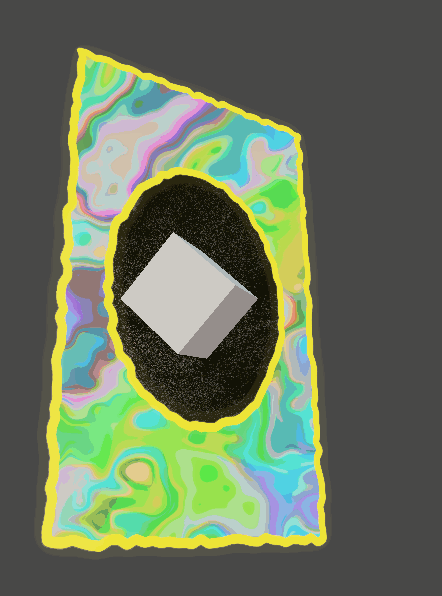

This Unity URP project renders a stylized holographic card using a set of stencil-masked shaders.

The HologramSurface then uses the stencil buffer yielding a cool hologram-like render confined to the masked region which using uv offsets and noise to make a cool hologram like effect.

