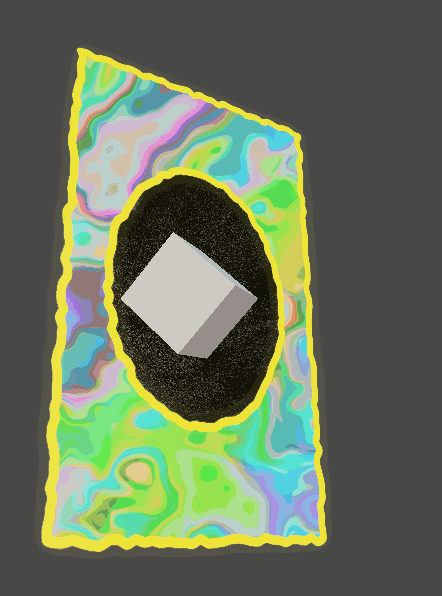

# Unity Holographic Card

> A stylized holographic card shader using stencil masking, UV offsets, and noise for a convincing hologram effect.

---

## Overview

This URP (Universal Render Pipeline) project demonstrates advanced shader techniques to create a realistic holographic card effect. Using stencil buffer masking and procedural noise, it confines the hologram effect to a specific region on the card.

---

## Technical Details

### Shaders Used

- **Stencil-Masked Shaders** — Define the holographic render region
- **HologramSurface** — Main shader using:
  - Stencil buffer for region masking
  - UV offsets for distortion
  - Procedural noise for shimmer effect
  - Alpha blending for transparency

### Pipeline

- **Unity Version:** Uses Universal Render Pipeline (URP)
- **Shader Model:** Works with modern GPU capabilities
- **Performance:** Optimized for real-time rendering

---

## Features

- **Stencil Masking** — Hologram confined to masked region
- **Procedural Effects** — Noise-based shimmer and distortion
- **Scalable** — Can be applied to different card sizes
- **Customizable** — Adjustable intensity, color, and animation speed

---

## Screenshots



---

## Getting Started

### Requirements

- **Unity 2020.3 LTS** or later
- **Universal Render Pipeline (URP)**
- GPU with shader model 4.0+ support

### Installation

1. Clone repository: `git clone https://github.com/s4lt3d/Unity-Holographic-Card.git`
2. Open in Unity with URP enabled
3. Navigate to shader folder
4. Create new material with HologramSurface shader
5. Apply to your card mesh

---

## Usage

### Basic Setup

1. **Create a Material**
   - Right-click in project → Create → Material
   - Set shader to "Custom/HologramSurface"

2. **Assign to Card**
   - Select card mesh in scene
   - Drag material to Mesh Renderer

3. **Configure Shader Properties**
   - Adjust `Hologram Intensity` (0-1)
   - Change `Hologram Color` (RGB)
   - Modify `Shimmer Speed` (animation frequency)
   - Set `Distortion Amount` (effect strength)

4. **Optional: Animate**
   - Add script to animate UV offsets over time
   - Adjust shader parameters dynamically

---

## Shader Properties

### Main Settings

- **Hologram Intensity** — Overall brightness of effect (0-1)
- **Hologram Color** — RGB color of holographic glow
- **Alpha** — Transparency level
- **Emissive** — Self-illumination amount

### Effect Settings

- **Shimmer Speed** — Animation frequency (0.1-10)
- **Distortion Amount** — UV distortion strength (0-5)
- **Noise Scale** — Procedural noise detail (0.1-10)
- **Scroll Speed** — UV animation speed

### Stencil Settings

- **Stencil Reference** — Reference value (0-255)
- **Stencil Comparison** — Equal/NotEqual/Always
- **Write Mask** — Which stencil bits to write

---

## Customization

### Animating the Effect

```csharp
// Script to animate hologram
public class HologramAnimator : MonoBehaviour {
    public Material hologramMaterial;
    public float scrollSpeed = 2f;

    void Update() {
        float offset = Time.time * scrollSpeed;
        hologramMaterial.SetFloat("_UVOffset", offset);
    }
}
```

### Color Variations

In material inspector, adjust:
- Base color for tone
- Emission for glow intensity
- Alpha for transparency

### Performance Tuning

For lower-end devices:
- Reduce noise scale (less detail)
- Lower shimmer speed (fewer updates)
- Use smaller textures
- Disable animation if static acceptable

---

## Technical Architecture

### Shader Pipeline

1. **Vertex Shader**
   - Applies UV offsets
   - Animates distortion
   - Applies world position

2. **Fragment Shader**
   - Samples procedural noise
   - Applies stencil mask
   - Calculates hologram color
   - Blends with base material

### Stencil Masking

The stencil buffer is used to:
- Confine effect to card region
- Prevent overflow to background
- Layer multiple holographic effects

### Procedural Noise

Uses Perlin-like noise for:
- Natural shimmer effect
- Organic distortion patterns
- Time-based animation

---

## Project Structure

```
Assets/
├── Shaders/
│   ├── HologramSurface.shader    — Main shader
│   ├── StencilSetup.shader       — Setup shader
│   └── Include/
│       └── NoiseLibrary.cginc    — Noise functions
├── Materials/
│   └── Hologram.mat              — Example material
├── Models/
│   └── Card.fbx                  — Sample card mesh
├── Scenes/
│   └── HologramDemo.unity        — Demo scene
└── Scripts/
    └── HologramAnimator.cs       — Animation helper
```

---

## Examples

### Static Hologram

1. Create material with shader
2. Set properties
3. Apply to mesh
4. No animation needed

### Animated Hologram

1. Create material and assign
2. Add HologramAnimator script
3. Adjust animation speed
4. Hologram animates automatically

### Multiple Holographic Cards

Create multiple materials:
- Different colors for each card
- Stagger animation phases
- Layer with different intensity levels

---

## Performance

### GPU Cost

- **Shader**: Moderate per-pixel cost
- **Stencil**: Minimal stencil buffer overhead
- **Noise**: Computed per-pixel (optimization opportunity)

### Optimization Tips

- **Pre-baked noise** — Use texture instead of procedural
- **Reduced complexity** — Simpler shader for mobile
- **Batching** — Group cards with same material
- **LOD** — Disable on distant cards

---

## Troubleshooting

### Hologram Not Showing

- Verify URP is enabled
- Check material assigned to renderer
- Confirm mesh has valid UVs
- Test with demo scene first

### Stencil Issues

- Verify stencil reference value
- Check stencil comparison mode
- Ensure stencil is not disabled

### Performance Issues

- Use simpler noise (texture vs procedural)
- Reduce update frequency
- Lower resolution textures
- Disable on lower-end devices

---

## Advanced Techniques

### Layered Hologram

Combine multiple materials:
- Base hologram layer
- Shimmer overlay
- Color shift layer

### Interactive Hologram

Respond to events:
- Increase intensity on selection
- Change color based on state
- Animate based on gameplay

### Real-time Updates

Adjust properties in gameplay:
```csharp
material.SetColor("_HologramColor", newColor);
material.SetFloat("_Intensity", newIntensity);
```

---

## References

- Universal Render Pipeline documentation
- Shader graphs and stencil masking
- Procedural noise generation techniques

---

## License

Copyright © Walter Gordy
